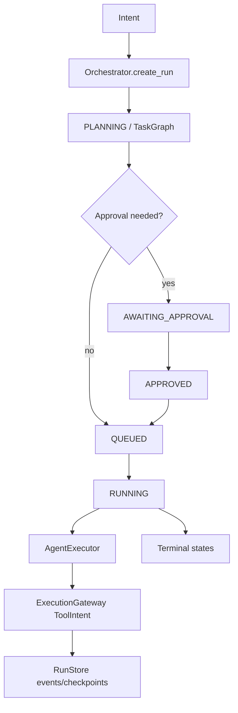

# M48.1 — Canonical Runtime Map

## Canonical flow (evidence-backed)

```text
User / Chat / Mission intent
  → Orchestrator.create_run (agent_runtime)
  → PLANNING → task DAG (TaskGraph)
  → optional AWAITING_APPROVAL (RiskClass ≥ LOCAL_MUTATION)
  → QUEUED → RUNNING
  → AgentExecutor (gateway-backed inference / tools)
  → ExecutionGateway for side effects (ToolIntent)
  → RunStore events + checkpoints
  → COMPLETED | FAILED | CANCELLED | TIMED_OUT | BLOCKED | PARTIALLY_COMPLETED
```



## Ownership boundaries

| Concern | Owner module |
|---|---|
| Multi-agent run lifecycle | `saathi.agent_runtime` |
| Side-effecting tools | `saathi.execution` (ExecutionGateway) |
| Model selection | `saathi.model_router` (+ chat helpers) |
| Memory scopes | `saathi.memory.engine` |
| Mission / pipeline jobs | missions + graph packages (layered; do not replace M10) |
| Finance orders | `saathi.execution.trade` (separate; Trading Guardian advisory in UI) |

## Duplicates (documented, not merged in M48.1)

1. **M8 chat `run_agent`** vs **M10 Orchestrator** — chat remains; multi-agent uses orchestrator.  
2. **IELTS `saathi.agents`** — domain, provider-direct; out of general runtime.  
3. **Pipeline graph** vs **M10 TaskGraph** — different durability domains.  
4. **Finance ExecutionStatus** vs **ToolExecutionStatus** — intentionally namespaced.

## UI integration

- SaathiOS `/chat` + Copilot → BFF chat APIs → ChatEngine / optional orchestration.  
- Approvals inbox → server decide; never UI-only authority.  
- Control Center / CEO surfaces read run metrics (read-only).

## Failure handling

Illegal transitions raise; approvals expire; cancel/pause cooperative via store; unavailable provider must not be success (`contracts.provider_status_is_success`).
